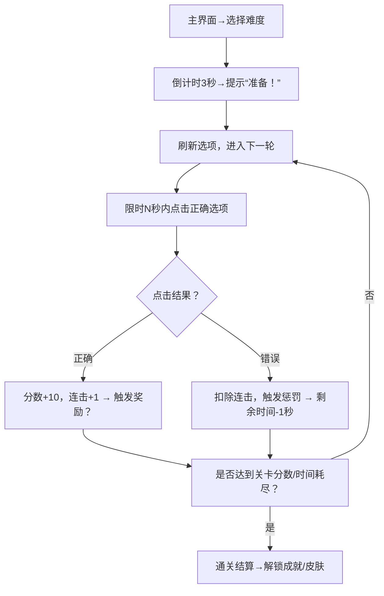

# 《字色快打！》Web反应类游戏设计文档  
（基于“JS开发+颜色文字配对+卡通美术+连击奖惩”核心需求，分模块拆解👇）  


## 一、项目概述  
### 1. 游戏定位  
- **名称**：《字色快打！》（活泼易记，突出“反应快点击”的核心体验）  
- **类型**：休闲反应类（Web端轻游戏，支持手机/PC浏览器即点即玩）  
- **一句话简介**：在Q萌卡通世界里，挑战“文字颜色”和“文字内容”的极速配对！连击奖励爽到起飞，错误惩罚笑到捶桌——手速与眼力的双重考验，你能坚持多少轮？  


## 二、核心玩法设计  
### 1. 规则逻辑（先确认！关键中的关键👇）  
游戏的**“正确点击”判定规则**：  
按钮的 **「字体颜色」 ≠ 「文字内容所指的颜色」**（例：  
- 按钮字体是红色（`color: red`），文字是“黄” → 颜色≠内容 → 正确，点击得分；  
- 按钮字体是红色（`color: red`），文字是“红” → 颜色=内容 → 错误，触发惩罚）。  

👉 需确认：这个规则是否符合你预期？若想反过来（颜色=内容为正确），随时调整～  


### 2. 单局流程（以“关卡制”为例）  



### 3. 核心爽点系统  
- **连击奖励**：连续正确点击→连击数累计，达5/10/15次时触发buff：  
  - 5连击：3秒内分数×2；  
  - 10连击：下轮额外+2秒答题时间；  
  - 15连击：临时“错误免疫”（1次错误不计惩罚）。  
- **错误惩罚**：点击错误时触发多重反馈：  
  - 视觉：按钮变红+左右抖动（CSS关键帧动画）；  
  - 音效：滑稽搞怪的“选错啦”音效；  
  - 数值：连击清0，剩余时间-1秒（最低保留1秒）。  


## 三、美术风格规范（卡通向）  
### 1. 视觉调性  
- 整体风格：**Q版萌系**，色彩饱和度高，元素带圆润边角、渐变/阴影增强立体感，拒绝锐利线条。  
- 适配场景：支持手机竖屏/PC横屏，界面元素大且触控友好（按钮尺寸≥80px×80px）。  


### 2. 关键视觉模块  
| 模块         | 设计细节                                                                 | 示例参考（可替换）                     |  
|--------------|--------------------------------------------------------------------------|----------------------------------------|  
| 选项按钮     | 圆角矩形气泡框，边框2px深色描边；点击时缩放至0.95倍（CSS `transform`）     | 参考《羊了个羊》关卡按钮+弹性反馈      |  
| 引导NPC      | 戴眼镜的小精灵（胜利时跳舞、错误时捂脸扶额），用2D骨骼动画循环播放表情   | 参考《保卫萝卜》怪物卡通化+动态反馈     |  
| 特效         | - 奖励：连击达成时飘星星/闪光粒子（CSS动画+伪元素）<br>- 惩罚：错误时屏幕短暂黑白闪 | 参考《胡闹厨房》失败时的搞怪特效        |  
| 界面         | 主界面背景：游乐园/糖果屋（动态光斑漂浮）；游戏界面：半透明毛玻璃UI框     | 参考《纪念碑谷》轻量动态背景+清新UI     |  


## 四、系统功能设计  
### 1. 关卡与难度  
- 基础难度（前5关）：3个选项，5秒限时，颜色池仅「红、黄」（降低认知负担）；  
- 进阶难度（6 - 10关）：5个选项，3秒限时，颜色池扩展「蓝、绿」（增加干扰）；  
- 地狱难度（11 + 关）：选项混入「粉、紫」等相似色+干扰项（文字为“彩虹”等非颜色词，点击直接错误）。  


### 2. 成就与收集  
- **里程碑成就**：“连击王者”（单次15连击）、“速通达人”（1分钟内通关3关）、“不屈战神”（连续错误5次仍通关）；  
- **收集向成就**：解锁所有颜色池（通关地狱难度）、收集NPC全表情（错误10次解锁“崩溃脸”）。  


### 3. 存档与分享  
- 本地存储：记录**最高分数、最高连击、已解锁关卡/成就**（用JS `localStorage` 实现）；  
- 社交分享：结算页生成“分数海报”（Canvas截图+卡通边框），支持分享到微信/朋友圈。  


## 五、技术实现方案（JS原生开发）  
### 1. 技术栈与架构  
- 结构：HTML（容器层，放按钮、UI元素） + CSS（样式+动画） + Vanilla JS（逻辑控制）；  
- 优势：无框架依赖，兼容所有浏览器，加载速度快（Web游戏核心诉求）。  


### 2. 核心逻辑代码框架（伪代码）  
```javascript
// 1. 颜色-文字映射（确保规则判定）
const textMap = { '红': 'red', '黄': 'yellow', '蓝': 'blue', '绿': 'green' };

// 2. 生成随机选项（确保颜色≠文字对应值）
function generateOption() {
  const colors = ['red', 'yellow', 'blue', 'green'];
  const texts = ['红', '黄', '蓝', '绿'];
  let color, text;
  do {
    color = colors[Math.floor(Math.random() * colors.length)];
    text = texts[Math.floor(Math.random() * texts.length)];
  } while (color === textMap[text]); // 核心规则：颜色≠文字对应值
  return { color, text };
}

// 3. 点击事件处理
function checkAnswer(button) {
  const targetColor = button.style.color;
  const targetText = button.innerText;
  if (targetColor !== textMap[targetText]) { // 正确判定
    score += 10;
    combo++;
    if (combo % 5 === 0) triggerBonus(combo); // 连击奖励
  } else { // 错误判定
    combo = 0;
    time -= 1;
    playErrorAnim(button); // 触发抖动+音效
  }
}

// 4. 动画与特效（CSS+JS结合）
function playErrorAnim(button) {
  button.classList.add('shake'); // CSS抖动动画
  setTimeout(() => button.classList.remove('shake'), 500);
  new Audio('error-sound.mp3').play(); // 错误音效
}
```  


## 六、测试与迭代计划  
### 1. 测试阶段  
- 内部逻辑测试：验证“颜色≠文字”判定、连击奖惩触发、时间计算是否精准；  
- 灰度体验测试：发布GitHub Pages Demo，邀请50 + 玩家测试，统计**平均通关时长、错误率Top3关卡、放弃率**；  
- 商业化测试：接入广告（如激励视频，看广告复活/翻倍分数），测试变现效率。  


### 2. 迭代方向  
- 玩法扩展：双人对战（同屏竞赛，错误给对方加干扰项）、限时生存（无限关卡，看极限连击）；  
- 美术迭代：节日皮肤（圣诞红配绿、中秋玉兔背景）、自定义皮肤（玩家上传头像做NPC）；  
- 技术优化：用`Web Workers`分担随机生成压力，避免卡顿；适配H5小游戏平台（微信/抖音）。  


### 现在需要你反馈～  
1. 规则是否要调整？（比如“颜色=文字”才正确，或加入更多颜色词？）  
2. 美术风格有没有特别喜欢的参考（比如某款卡通游戏的UI/角色）？  
3. 技术实现部分，是否需要更详细的代码注释/功能拆分？  

确定方向后，我们可以继续细化**某一模块（比如关卡数值表、美术资源清单、JS动画代码）**，把文档落地到可开发的程度～ 🚀